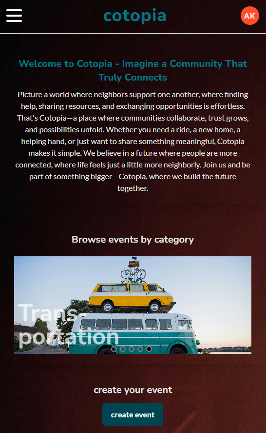

# cotopia

### Description

This repository contains the Express.js backend for the final project of the Ironhack Web Development Bootcamp. It uses MongoDB and REST API.

cotopia is a single page website on which people can exchange offers or requests for events, help, real estate, trade or transportation with the community. The idea of this platform is to provide one place for communities rather than having multiple messanger groups.

Backend Tech-Stack:

- JavaScript
- Express.js
- Mongoose
- bcrypt
- jsonwebtoken
- git

The backend repository can be found here: [cotopia-frontend](https://github.com/andrekaltenbach/cotopia-frontend)

### Instructions to run this app in my computer

- fork the repository
- clone the repository (git clone)
- navigate to directory of the clone
- install dependencies: `npm install`
- setup environment variables in .env:
  - create a file `.env` in the root directory
  - `PORT=5005`
  - `ORIGIN=http://localhost:3000`
  - `TOKEN_SECRET=<insert a jwt secret token here>`
- run the app: `npm run dev`

### Demo

The backend was deployed using MongoDB Atlas and render.com. The frontend was deployed using Netlify.

You can find the deployed version here: [cotopia-app](https://cotopia-app.netlify.app/)

